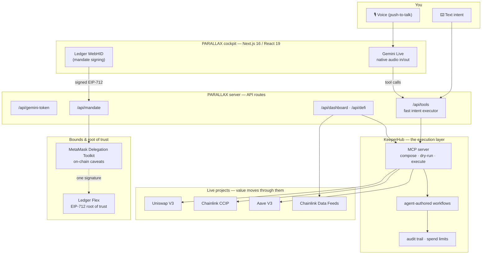
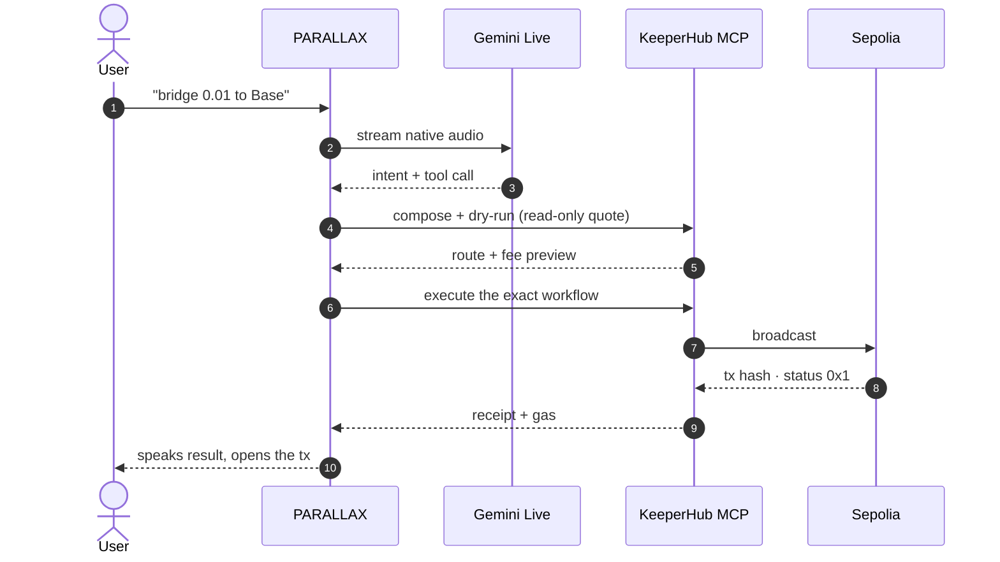

<div align="center">

# PARALLAX

### The world's first voice-native agentic wallet — powered by KeeperHub as its execution layer.

**Speak one sentence. It executes on-chain — deterministically, within bounds you signed once on a Ledger.**

Say *"bridge 0.01 to Base,"* *"swap ETH into USDC,"* *"invest 50 USDC and keep the yield good."*
Gemini understands the intent. **KeeperHub composes, dry-runs, and executes it.** MetaMask bounds it.
A Ledger Flex signature authorizes it. Every action is a **real, verifiable on-chain transaction.**

`Gemini Live (native voice)` · `KeeperHub MCP` · `MetaMask Delegation Toolkit` · `Ledger Flex` · `Aave V3` · `Uniswap V3` · `Chainlink CCIP` · `Multichain` · `Next.js 16`

**▶ [Live app](https://parallax-seven-mu.vercel.app) · [Demo video](https://www.youtube.com/watch?v=BBP6N9mG5Ds) · [Self-test the whole stack](https://parallax-seven-mu.vercel.app/api/selftest)**

</div>

---

## Submission at a glance

| Requirement | Link |
|---|---|
| **Source code** | https://github.com/chrsnikhil/parallax |
| **Demo video** | **[▶ Watch the demo](https://www.youtube.com/watch?v=BBP6N9mG5Ds)** |
| **A transaction executed through KeeperHub** | [`0xde473184…1408c3` (Uniswap swap)](https://sepolia.etherscan.io/tx/0xde4731840319b8f7b57fce6dc4b6fbc8d3abcdb8dce35cd15a4f1578aa1408c3) |
| **Live deployment** | https://parallax-seven-mu.vercel.app |
| Network | Sepolia (testnet) |

---

## Why PARALLAX

Agents are probabilistic. Moving money can't be. Ask a normal AI wallet to "move funds" and it reinterprets what you meant at the exact moment it matters — every time. **PARALLAX removes the reinterpretation.** Your spoken intent is parsed once, composed into a concrete KeeperHub workflow, dry-run against live quotes, and then that exact workflow executes. Nothing is inferred at execution time.

And it's bounded by hardware: you sign **one** mandate on a Ledger Flex, and the agent can only ever touch the protocols and actions you allowlisted — enforced on-chain by MetaMask's Delegation Manager, not by the app. **Convenience and security at the same time**, which wallets have always forced you to trade off.

This is what a wallet looks like when the agent economy is real: **you talk, it executes, KeeperHub guarantees it.**

---

## Execution through KeeperHub — proven on-chain

KeeperHub is the **execution layer** for every value movement in PARALLAX. Each item below is a **real, mined Sepolia transaction** triggered by voice through the live stack — click and verify.

| Action | Live project executed through KeeperHub | Transaction |
|---|---|---|
| **Swap** | Uniswap V3 | [`0xde473184…1408c3`](https://sepolia.etherscan.io/tx/0xde4731840319b8f7b57fce6dc4b6fbc8d3abcdb8dce35cd15a4f1578aa1408c3) |
| **Send** | ERC-20 / native transfer | [`0xf269b0b8…9dd841`](https://sepolia.etherscan.io/tx/0xf269b0b8d92f3bd767d268159797d28f3b1c46dbd0ff32bc9a2a9259529dd841) |
| **Protocol interaction** | WETH `deposit` (wrap) | [`0x2825612f…cdc20e`](https://sepolia.etherscan.io/tx/0x2825612fd4b2374dc73ceace8cd6c10e085dd7702899f5836f69f12dc8cdc20e) |
| **Bridge** | Chainlink CCIP (Sepolia → Base Sepolia) | [`0xdcd642c8…ef9355`](https://sepolia.etherscan.io/tx/0xdcd642c80585abf282777f6d6f3d665c5bd1b1af9e429a789645dad765ef9355) |
| **One-shot bridge** | *"bridge 0.01 to base"* — single voice command, zero manual steps | [`0x498508bc…f1fc90`](https://sepolia.etherscan.io/tx/0x498508bcb4e7cd64dfb05c0cc8990fe2c94b02e804e39a3efcbb7c1addf1fc90) |
| **Autonomous yield** | Aave V3 supply + an armed auto-rotation workflow | [`0x3352616…c9a06e`](https://sepolia.etherscan.io/tx/0x3352616471da95e88b38ca346d6bce6fccdeb20a4e01c71e5259663711c9a06e) |
| **Bounded execution** | MetaMask delegation redemption inside signed caveats | [`0xeecafcc6…7da345`](https://sepolia.etherscan.io/tx/0xeecafcc67c8ea26002962fdb65bd67311dfa4999b0282cfa64bfd5db7f7da345) |

Every one of these is voice-triggered. The agent speaks the result back and opens the transaction — and, for autonomous invest, the KeeperHub workflow — automatically.

---

## KeeperHub surfaces used

- **MCP server** — a server-side MCP client (JSON-RPC over Streamable HTTP to `app.keeperhub.com/mcp`) drives the entire catalog: **47 protocols, 491 actions, 24 chains.** Every voice command resolves to a real KeeperHub call.
- **Agent-authored workflows** — the voice agent builds real KeeperHub workflows from natural language (`create_workflow` / `execute_workflow`), including the autonomous yield-rotation workflow armed after an invest.
- **Dry-run before execution** — reads and quotes are resolved through KeeperHub without touching the chain, so the exact composed action is what executes.
- **Audit trail** — `list_executions` and `get_spending_limits` feed the live dashboard: real balances, real spend caps, real execution history, every run accounted for.

---

## Architecture



**The whole pipeline, end to end:**



---

## Integration depth — real, named, live projects

PARALLAX doesn't wrap KeeperHub generically. It makes KeeperHub the execution layer **inside** integrations with concrete, live products:

- **MetaMask Delegation Toolkit (v0.13)** — a real Hybrid DeleGator smart account holds funds; a `functionCall`-scoped delegation encodes the mandate as on-chain caveats (allowed targets, allowed selectors, spend cap, expiry). The agent redeems within them via the Delegation Manager. **Deployed and proven on Sepolia** (`0x13E12020ABA4Fac6f176EcFaD778F787628602A6`).
- **Ledger Flex** — the mandate is signed on a real device over WebHID using the Ledger **Device Management Kit**. One tap, one EIP-712 signature, and the agent inherits exactly the authority you granted — nothing more.
- **Aave V3** — real supply positions for the autonomous-yield flow, executed through KeeperHub.
- **Uniswap V3** — real swaps, on any supported chain.
- **Chainlink** — CCIP for cross-chain bridging; Data Feeds for live pricing across the dashboard and portfolio.
- **Google Gemini Live** — full-duplex native-audio voice (not TTS): the agent understands, calls the tool, and speaks the result.

---

## Reliability & observability

- **On-chain enforcement, not UI checks.** An allowed action inside the mandate mines; an off-mandate target **reverts** (`AllowedTargetsEnforcer:target-address-not-allowed`), and an over-cap spend reverts (`NativeTokenTransferAmountEnforcer:allowance-exceeded`). The bounds are real caveats enforced by the Delegation Manager.
- **Dry-run discipline.** Protocol actions never "simulate-then-hope" — previews use read-only quotes and the real action fires exactly once, so what you review is what executes.
- **Cost-aware.** After every transaction PARALLAX reads the receipt and tells you the real gas cost in ETH and USD.
- **One-command health check.** `GET /api/selftest` exercises the entire stack — dashboard, multichain portfolio, Chainlink price oracle, swap/bridge/wrap previews, MetaMask account, mandate + Ledger context, Gemini voice token, and autonomous-yield preview — read-only, no wallet, no human. It returns a green board plus the proven-tx hashes.
- **Live audit trail.** Real balances, spend limits, and execution history stream straight from KeeperHub into the cockpit.

---

## Autonomous by design

Say *"invest 50 USDC of my funds and keep the yield good."* PARALLAX makes a **real Aave V3 deposit** and **arms a real KeeperHub workflow** that autonomously monitors yields across venues and rotates the position to the best market — then tells you it's doing so, with the live APY and the gas it cost. The agent doesn't just execute once; it sets up ongoing, deterministic automation on KeeperHub.

---

## Tech stack

- **Framework:** Next.js 16 (App Router, Turbopack), React 19, TypeScript
- **Chain:** viem, Sepolia + testnet CCIP lanes, Chainlink Data Feeds
- **Execution:** KeeperHub MCP client
- **Bounds:** `@metamask/delegation-toolkit` v0.13
- **Hardware:** Ledger Device Management Kit (`@ledgerhq/device-management-kit`, `device-signer-kit-ethereum`, WebHID)
- **Voice:** `@google/genai` Gemini Live (half-cascade, native voice, English-pinned transcription)

---

## Run it

```bash
git clone https://github.com/chrsnikhil/parallax
cd parallax
npm install --legacy-peer-deps
cp .env.example .env.local     # add your keys
npm run dev                    # http://localhost:8137
```

All secrets are server-side only — the browser never sees a key, only short-lived ephemeral Gemini tokens. See [`.env.example`](.env.example).

---

## How PARALLAX maps to the judging criteria

| Criterion | PARALLAX |
|---|---|
| **Integration depth** | Named, live projects — MetaMask Delegation Toolkit, Ledger, Aave V3, Uniswap V3, Chainlink — with KeeperHub as the execution layer inside each. |
| **Execution through KeeperHub** | Seven distinct, verifiable on-chain transactions, every one voice-triggered through KeeperHub. |
| **Reliability & observability** | On-chain caveat enforcement, dry-run discipline, gas accounting, a one-call self-test, and a live audit trail. |
| **Usefulness & originality** | The first voice-native agentic wallet: bounded, cost-aware, and autonomous — usable by anyone who can speak. |
| **Developer experience & code quality** | Typed end to end, clean API surface, architecture diagrams, and a self-test another team can run in one command. |

---

<div align="center">

**PARALLAX** — you talk, it executes, KeeperHub guarantees it.

</div>
