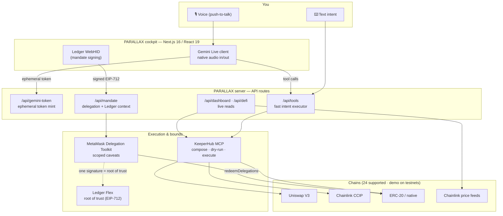
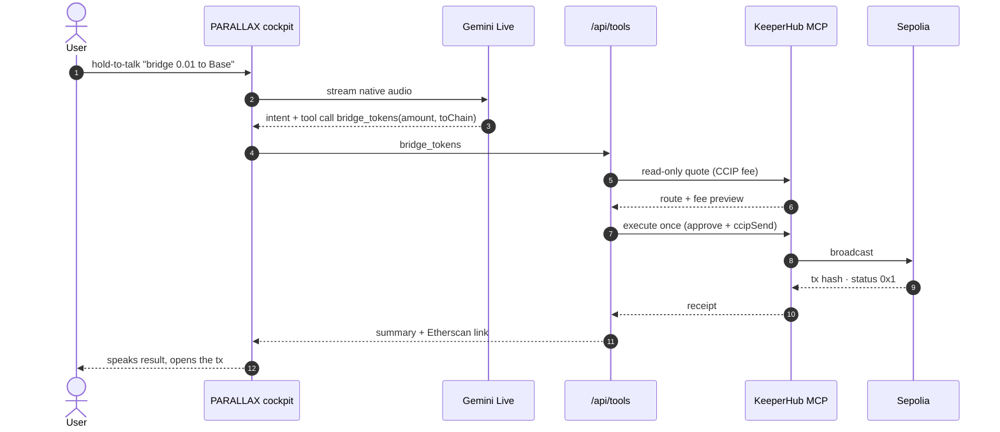
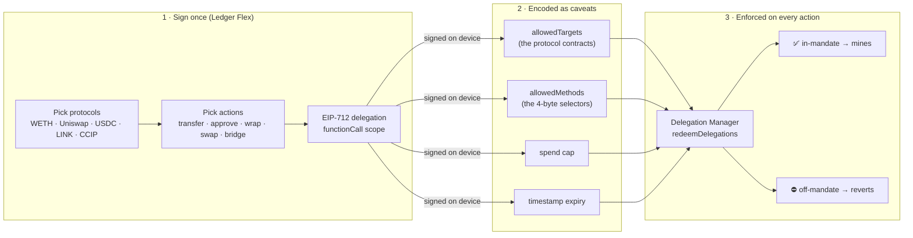

<div align="center">

# PARALLAX

### Speak your intent. It executes on-chain — inside bounds you sign once on a Ledger.

**A voice-first crypto wallet for the KeeperHub "Agent Economy" track.**
Say what you want. Gemini understands it. KeeperHub executes it. MetaMask bounds it. Ledger authorizes it.
Every action is a real, verifiable transaction.

`Voice + Gemini Live` · `KeeperHub MCP` · `MetaMask Delegation Toolkit` · `Ledger Flex` · `Multichain` · `Next.js 16`

### ▶ Live: [parallax-seven-mu.vercel.app](https://parallax-seven-mu.vercel.app) · Self-test: [`/api/selftest`](https://parallax-seven-mu.vercel.app/api/selftest)

</div>

---

## Why PARALLAX

Wallets have become data terminals. To do anything real you juggle RPCs, gas, approvals, routers, bridges, slippage, and a dozen browser popups — then you sign each one blind. That is not how people should move money.

PARALLAX collapses all of it into one sentence. You say *"bridge 0.01 to Base"* or *"swap ETH into LINK"* or *"send Sarah 5 USDC."* The agent figures out the route, composes the calls, and executes them on-chain — but only ever inside a **mandate you signed once on your Ledger Flex**: which protocols it may touch, which actions it may take, how much it may spend, for how long. Convenience and security at the same time, which wallets have always forced you to trade off.

That is the thesis of the demo: **this is what a wallet looks like when the agent economy is real.**

---

## Proven on-chain — the four KeeperHub demo requirements

Every requirement is a **real, mined Sepolia transaction** (`status 0x1`), triggered by voice through the live stack. Not screenshots, not mocks.

| # | Requirement | Action | Transaction |
|---|-------------|--------|-------------|
| 1 | **Swap** | ETH → token via **Uniswap V3** | [`0xde473184…1408c3`](https://sepolia.etherscan.io/tx/0xde4731840319b8f7b57fce6dc4b6fbc8d3abcdb8dce35cd15a4f1578aa1408c3) |
| 2 | **Send** | ERC-20 / native transfer | [`0xf269b0b8…9dd841`](https://sepolia.etherscan.io/tx/0xf269b0b8d92f3bd767d268159797d28f3b1c46dbd0ff32bc9a2a9259529dd841) |
| 3 | **Protocol interaction** | WETH `deposit` (wrap ETH) | [`0x2825612f…cdc20e`](https://sepolia.etherscan.io/tx/0x2825612fd4b2374dc73ceace8cd6c10e085dd7702899f5836f69f12dc8cdc20e) |
| 4 | **Bridge** | cross-chain via **Chainlink CCIP** (Sepolia → Base Sepolia) | [`0xdcd642c8…ef9355`](https://sepolia.etherscan.io/tx/0xdcd642c80585abf282777f6d6f3d665c5bd1b1af9e429a789645dad765ef9355) |

**Bonus proofs**

| Proof | What it shows | Transaction |
|-------|---------------|-------------|
| One-shot bridge | *"bridge 0.01 to base"* → single voice command, no manual wrap/swap | [`0x498508bc…f1fc90`](https://sepolia.etherscan.io/tx/0x498508bcb4e7cd64dfb05c0cc8990fe2c94b02e804e39a3efcbb7c1addf1fc90) |
| Mandate enforcement | An **allowed** action (WETH deposit) inside a Ledger-signed mandate succeeds… | [`0xeecafcc6…7da345`](https://sepolia.etherscan.io/tx/0xeecafcc67c8ea26002962fdb65bd67311dfa4999b0282cfa64bfd5db7f7da345) |
| Mandate rejection | …and an **off-mandate** target reverts on-chain with `AllowedTargetsEnforcer:target-address-not-allowed` | *(revert — enforced by the Delegation Manager)* |
| Over-cap rejection | Spending past the signed cap reverts with `NativeTokenTransferAmountEnforcer:allowance-exceeded` | *(revert — enforced by the Delegation Manager)* |

> The security model is **not** a UI check. The bounds are real MetaMask caveats enforced by the Delegation Manager at redemption — off-mandate calls physically cannot mine.

---

## Architecture



**Reading the diagram:** the browser never holds a key. It gets a short-lived ephemeral Gemini token and, for the mandate, produces exactly one EIP-712 signature on the Ledger. Everything with money attached runs server-side: KeeperHub is the execution engine, MetaMask's Delegation Toolkit encodes the bounds, and the Ledger signature is the single root of trust the whole agent inherits.

---

## Intent → execution, end to end



A critical detail the code respects: on KeeperHub, `execute_protocol_action` with `simulate:true` **still broadcasts**. So PARALLAX never "dry-runs" a protocol action — previews use **read-only quotes** (`uniswap/quote-exact-input`, `chainlink/ccip-get-fee`) and the real action fires **exactly once**, only on execute. That is why the flow above splits "quote" from "execute."

---

## The security model — a mandate signed on the Ledger Flex



You sign **one** EIP-712 approval on the Flex. That single signature becomes the root of trust for everything the agent may ever do — and the bounds are enforced *on-chain* by MetaMask's Delegation Manager, not by the app. The agent is powerful and safe at once: it can act without asking, but it can never step outside what your hardware wallet authorized.

- **Hardware signing** uses the Ledger **Device Management Kit** (DMK) over WebHID — `@ledgerhq/device-management-kit` + `device-signer-kit-ethereum` — path `44'/60'/0'/0/0`.
- **Delegation** uses the **MetaMask Delegation Toolkit** v0.13: a Hybrid DeleGator smart account, a `functionCall`-scoped delegation, and redemption via `DelegationManager.redeemDelegations` (no bundler — a relayer submits, the caveats do the enforcing).

---

## The integrations, in depth

### KeeperHub — the execution & automation engine (main track)
KeeperHub is not a bolt-on; it *is* how PARALLAX touches chains. A server-side MCP client (JSON-RPC over Streamable HTTP to `app.keeperhub.com/mcp`) drives the whole catalog — **47 protocols, 491 actions, 24 chains**. Every voice command and every scheduled automation resolves to a real KeeperHub call: quote → execute → receipt. Reads (balances, prices, spending limits, executions) come straight from KeeperHub + Chainlink feeds so the dashboard shows *your actual wallet*, not sample data.

### MetaMask — 100% real Delegation Toolkit integration
A **live** on-chain integration (MetaMask is not a sponsor — this is exactly the "integrate with a live project" the track asks for). A Hybrid DeleGator smart account holds funds; a scoped delegation encodes the mandate as real caveats; an agent EOA redeems within them. Deployed and proven on Sepolia.

### Ledger — the root of trust
The mandate is signed on a real **Ledger Flex** via the DMK device-signer. One tap, one EIP-712 signature, and the agent inherits exactly the authority you granted — nothing more.

### Gemini — the voice
Full-duplex **Gemini Live** with native audio in/out (not browser TTS): hold-to-talk, manual VAD, ephemeral tokens minted server-side, tool-calling straight into the executor. It understands the intent, calls the tool, and speaks the result back.

---

## Multichain & the smart router

The DeFi layer (`lib/defi.ts`) ships a `CHAINS` registry spanning Ethereum, Base, Arbitrum, Optimism, Polygon, Avalanche, BNB and their testnets, with a single pinned pair for maximum leverage: **Uniswap V3** for swaps and **Chainlink CCIP** for bridges. `readAllBalances()` aggregates a portfolio across chains; `resolveChain()` maps names/ids to routes.

The cinematic demo also presents the **smart router** — a vision for how PARALLAX picks the smartest way to move funds (direct send vs. swap vs. cross-chain bridge) from a single intent, then executes and proves it on-chain.

---

## Autonomous yield & cost-awareness

Say *"invest 50 USDC of my funds and keep the yield good."* PARALLAX makes a **real Aave V3 deposit**, then arms a **real KeeperHub workflow** that autonomously monitors yields across venues and rotates the position to the best market — and it tells you it's doing so. It's also **market-aware**: on Sepolia the stablecoin lending markets are at capacity, so the agent intelligently routes the deposit into Aave's uncapped LINK market instead of failing. Proven on-chain: [`0x3352616…`](https://sepolia.etherscan.io/tx/0x3352616471da95e88b38ca346d6bce6fccdeb20a4e01c71e5259663711c9a06e).

Every transaction is also **cost-aware**: after any on-chain action, PARALLAX reads the receipt and tells you exactly what it cost — e.g. *"Gas: 0.0002 ETH (~$0.48)"* — so the agent (and you) always know the price of a move.

---

## Tech stack

- **Framework:** Next.js 16 (App Router, Turbopack), React 19, TypeScript
- **Chain:** viem, Sepolia + testnet lanes, Chainlink price feeds
- **Execution:** KeeperHub MCP (`@modelcontextprotocol`-style JSON-RPC client)
- **Bounds:** `@metamask/delegation-toolkit` v0.13
- **Hardware:** Ledger DMK (`@ledgerhq/device-management-kit`, `device-signer-kit-ethereum`, WebHID)
- **Voice:** `@google/genai` Gemini Live (native audio)
- **Demo deck:** self-contained Three.js cinematic (`parallax-demo/`)

---

## Test it without a human

One request exercises the whole stack — every integration, read-only, no wallet popup, no mic, no spend. Hit it on the live deployment:

```bash
curl https://parallax-seven-mu.vercel.app/api/selftest | jq
# …or locally:
npm run dev && curl http://localhost:8137/api/selftest | jq
```

Returns a green/red check of **9 integrations** (dashboard, portfolio, price oracle, swap preview, bridge preview, protocol wrap preview, MetaMask account, mandate + Ledger context, Gemini voice token) plus the proven real-tx hashes. Live broadcasts and the Flex tap are the demo steps and are listed separately under `liveSteps`.

---

## Run it locally

```bash
git clone <this repo>
cd parallax
npm install --legacy-peer-deps        # Ledger DMK peers need this
cp .env.example .env.local            # then fill in your keys
npm run dev                           # http://localhost:8137
```

See [`.env.example`](.env.example) for every variable. All secrets are **server-side only** — the browser only ever receives short-lived ephemeral Gemini tokens.

> **Live-deploy note:** the API routes can trigger real transactions from the server-held keys. On any public deployment, treat the wallet keys as fully burnable, keep the daily spend cap low, and rotate them after the demo window.

---

## On-chain addresses (Sepolia)

| Role | Address |
|------|---------|
| MetaMask Smart Account (Hybrid DeleGator) | [`0x13E12020ABA4Fac6f176EcFaD778F787628602A6`](https://sepolia.etherscan.io/address/0x13E12020ABA4Fac6f176EcFaD778F787628602A6) |
| Delegation owner (root path) | [`0xB5161Fce7be43CeAd086dD2b6346EdCbA7416f57`](https://sepolia.etherscan.io/address/0xB5161Fce7be43CeAd086dD2b6346EdCbA7416f57) |
| Ledger Flex mandate signer | [`0xDeC312D5Fe0eaef03048BE83137f87cE7907A7Da`](https://sepolia.etherscan.io/address/0xDeC312D5Fe0eaef03048BE83137f87cE7907A7Da) |
| KeeperHub managed wallet | [`0x5623D4a6A316Cf9b16fF92808E3931E17CcB960C`](https://sepolia.etherscan.io/address/0x5623D4a6A316Cf9b16fF92808E3931E17CcB960C) |

---

## The cinematic demo

`parallax-demo/` is a self-contained Three.js deck (open `index.html`) that tells the story end to end: the thesis, the integrations wall, the mandate, the smart router, and the on-chain proof. Render to video with `render.sh`.

---

<div align="center">

**PARALLAX** — the future of wallets: voice-first, bounded, and provably on-chain.

</div>
